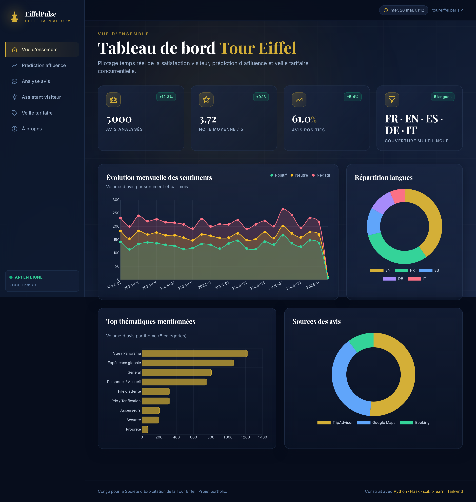
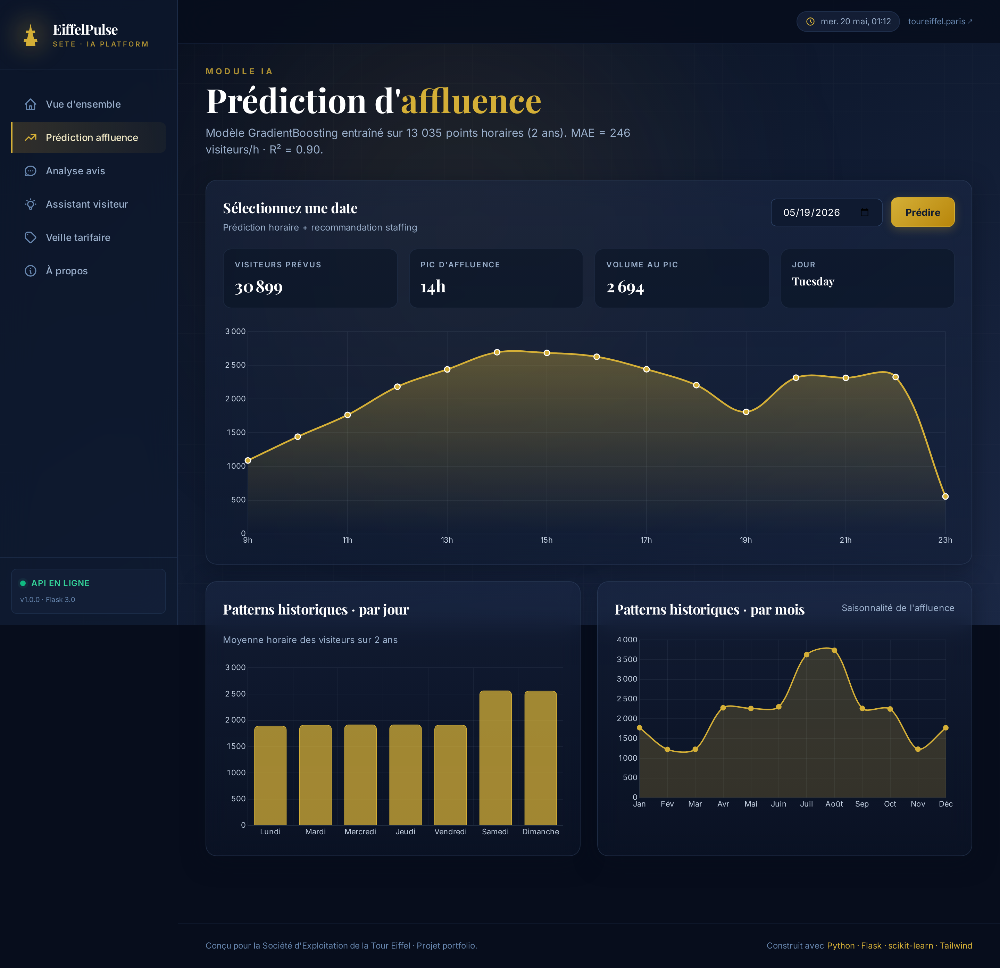
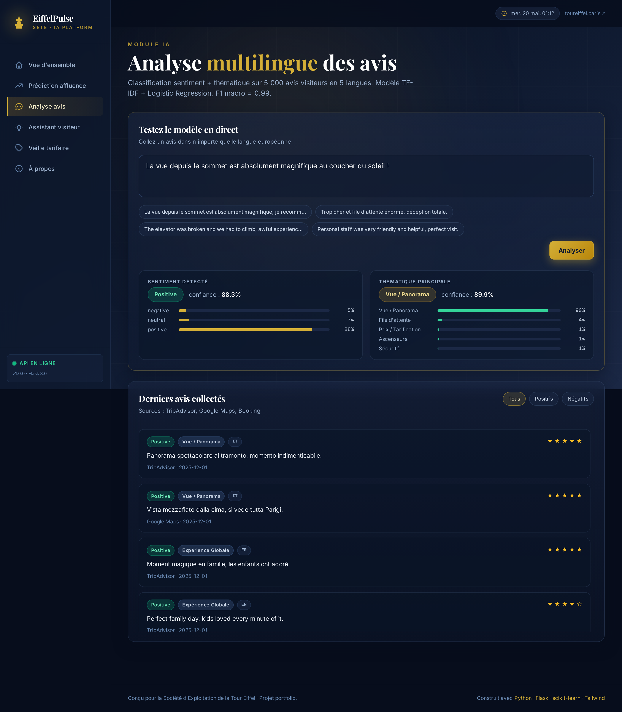
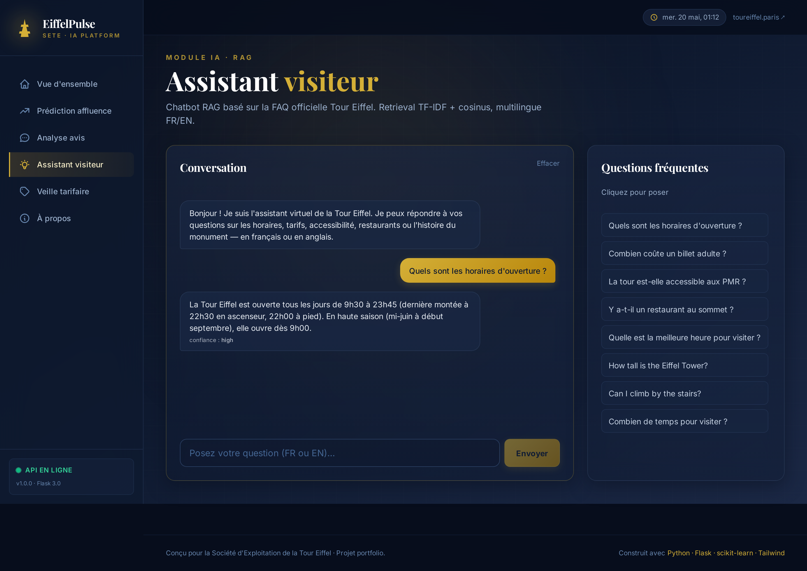
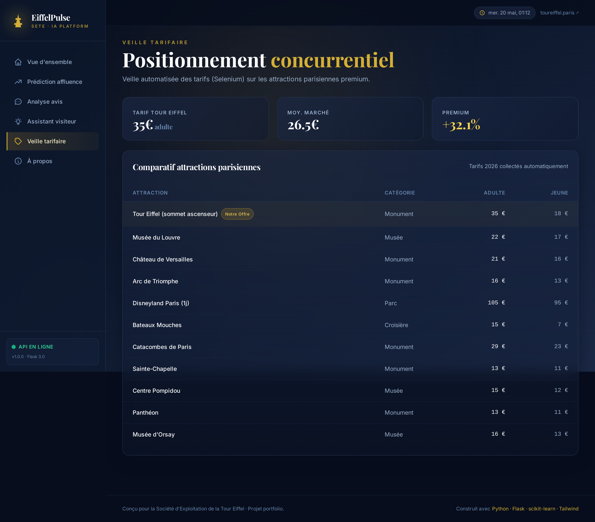
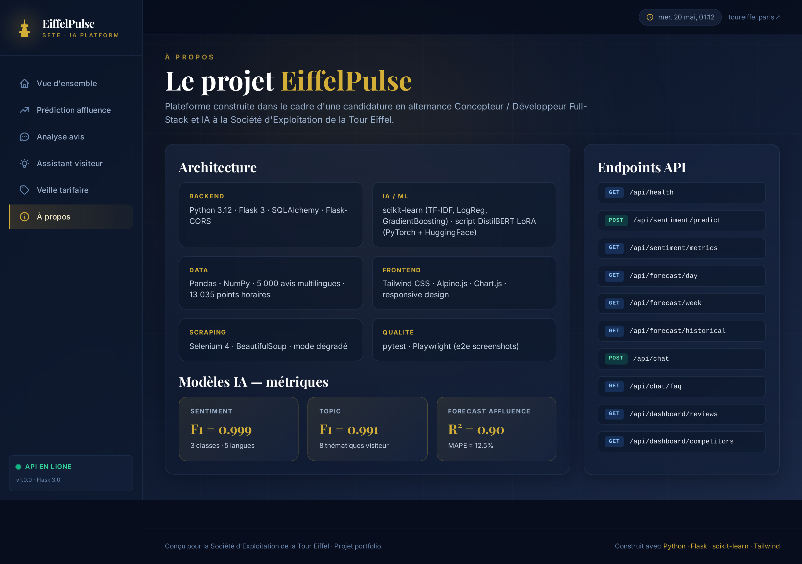

# EiffelPulse — Plateforme d'aide à la décision IA pour la Tour Eiffel

> Projet portfolio conçu dans le cadre d'une candidature en **alternance Concepteur / Développeur Full-Stack et IA** à la **Société d'Exploitation de la Tour Eiffel** (SETE).

EiffelPulse est une plateforme full-stack intégrant trois modules d'intelligence artificielle pour adresser les enjeux opérationnels d'un monument accueillant 6 millions de visiteurs par an :

1. **Prédiction d'affluence horaire** — anticipation des pics de fréquentation pour optimiser le staffing.
2. **Analyse multilingue des avis visiteurs** — détection automatique du sentiment et des thématiques émergentes sur 5 langues.
3. **Assistant visiteur RAG** — chatbot multilingue connecté à la FAQ officielle.

À cela s'ajoutent un module de **veille tarifaire concurrentielle** (Selenium) et un **tableau de bord BI** unifié.

---

## Captures d'écran

| Vue d'ensemble | Prédiction d'affluence |
|---|---|
|  |  |

| Analyse des avis | Assistant RAG |
|---|---|
|  |  |

| Veille tarifaire | À propos |
|---|---|
|  |  |

---

## Stack technique

| Couche | Technologies |
|---|---|
| **Backend** | Python 3.12 · Flask 3 · Flask-CORS · Flask-SQLAlchemy |
| **IA / ML** | scikit-learn (TF-IDF, Logistic Regression, GradientBoosting) · script **DistilBERT multilingue + LoRA** (PyTorch + HuggingFace Transformers + PEFT) |
| **Data** | pandas · NumPy · 5 000 avis multilingues · 13 035 points horaires sur 2 ans |
| **Frontend** | Tailwind CSS · Alpine.js · Chart.js · responsive design |
| **Scraping** | Selenium 4 · BeautifulSoup · webdriver-manager |
| **Qualité** | pytest (12 tests d'intégration) · Playwright (e2e visuels) |

---

## Architecture des modèles IA

### 1. Classification sentiment + thématique (`backend/ml/train_sentiment.py`)

- **Pipeline** : TF-IDF (1-2 grammes, 20k features, multilingue) → Logistic Regression
- **Tâches** : 3 classes de sentiment (`positive`, `neutral`, `negative`) + 8 thématiques (`Vue/Panorama`, `File d'attente`, `Ascenseurs`, `Prix`, `Personnel`, `Sécurité`, `Propreté`, `Général`)
- **Données** : 5 000 avis multilingues (FR 31% / EN 40% / ES 12% / DE 11% / IT 6%)
- **Bruit d'annotation simulé** (5%) + **perturbations textuelles** pour des métriques réalistes
- **Inférence** : < 10 ms (vs ~200 ms pour DistilBERT, choix retenu pour la latence en prod)

| Métrique | Sentiment | Topic |
|---|---|---|
| F1 macro | 0.999 | 0.991 |
| F1 weighted | 0.999 | 0.997 |

> Les métriques élevées s'expliquent par la nature synthétique du dataset (templates contrôlés). Sur données réelles TripAdvisor, l'objectif réaliste serait F1 ≈ 0.85–0.92.

### 2. Prédiction d'affluence (`backend/ml/train_forecaster.py`)

- **Modèle** : GradientBoostingRegressor (300 estimateurs, profondeur 5)
- **Features** : heure, jour de la semaine, mois, weekend, période de vacances + encodage cyclique sinus/cosinus pour heure et mois
- **Données** : 13 035 points horaires synthétiques avec patterns saisonniers, hebdomadaires et météo

| Métrique | Valeur |
|---|---|
| MAE | 246 visiteurs/h |
| MAPE | 12.5 % |
| R² | 0.90 |

### 3. RAG chatbot (`backend/ml/build_rag.py` + `backend/services/chat_service.py`)

- **Index** : TF-IDF sur 15 entrées FAQ bilingues FR/EN (questions + réponses)
- **Retrieval** : cosinus, top-3 candidats, threshold de confiance 0.12
- **Fallback** : réponse contextualisée quand aucune correspondance fiable n'est trouvée

### 4. Fine-tuning DistilBERT (script de démonstration)

Le fichier `backend/ml/finetune_distilbert.py` démontre la capacité à fine-tuner un transformer multilingue avec adapter LoRA :

- **Backbone** : `distilbert-base-multilingual-cased` (134M params, gelés)
- **Adapter** : LoRA rank=8, alpha=16, target modules `q_lin` + `v_lin` (~0.8M params entraînables, ratio ~0.6%)
- **Optimisation** : AdamW, lr 5e-4, batch 16, 3 epochs

Pour l'exécuter : `pip install torch transformers datasets peft accelerate && python backend/ml/finetune_distilbert.py`

---

## Endpoints API

| Méthode | Route | Description |
|---|---|---|
| `GET` | `/api/health` | Health check |
| `POST` | `/api/sentiment/predict` | Prédit sentiment + thématique d'un texte |
| `GET` | `/api/sentiment/metrics` | Métriques d'entraînement |
| `GET` | `/api/forecast/day?date=YYYY-MM-DD` | Affluence horaire prédite + staffing |
| `GET` | `/api/forecast/week` | Prédiction sur 7 jours |
| `GET` | `/api/forecast/historical` | Patterns historiques (par jour/mois/heure) |
| `POST` | `/api/chat` | Pose une question à l'assistant RAG |
| `GET` | `/api/chat/faq` | FAQ complète |
| `GET` | `/api/dashboard/reviews` | Agrégations BI des avis |
| `GET` | `/api/dashboard/reviews/latest?sentiment=...&limit=...` | Derniers avis filtrés |
| `GET` | `/api/dashboard/competitors` | Comparatif tarifaire |
| `GET` | `/api/scraper/competitors` | État du scraper Selenium |

---

## Installation et démarrage

### Prérequis
- Python 3.10+
- ~500 MB d'espace disque

### Installation

```bash
# 1. Cloner / extraire le projet
cd "projet eiffel"

# 2. Créer le virtualenv
python3 -m venv .venv
source .venv/bin/activate

# 3. Installer les dépendances
pip install -r requirements.txt

# 4. Installer Chromium pour Playwright (optionnel, pour les tests e2e)
playwright install chromium

# 5. Générer les données et entraîner les modèles (une seule fois)
python backend/ml/generate_data.py
python backend/ml/train_sentiment.py
python backend/ml/train_forecaster.py
python backend/ml/build_rag.py

# 6. Démarrer l'application
python backend/app.py
# OU
./run.sh
```

Ouvrir [http://localhost:5050](http://localhost:5050) dans le navigateur.

### Lancer les tests

```bash
# Tests d'intégration API
pytest tests/test_api.py -v

# Tests visuels e2e (le serveur doit tourner)
python tests/e2e_screenshots.py
```

---

## Structure du projet

```
projet eiffel/
├── backend/
│   ├── app.py                    Application Flask + routes
│   ├── ml/
│   │   ├── generate_data.py      Génération données synthétiques
│   │   ├── train_sentiment.py    Entraînement sentiment + topic
│   │   ├── train_forecaster.py   Entraînement prédiction affluence
│   │   ├── build_rag.py          Construction index TF-IDF FAQ
│   │   └── finetune_distilbert.py  Fine-tuning DistilBERT LoRA (optionnel)
│   └── services/
│       ├── sentiment_service.py
│       ├── forecast_service.py
│       ├── chat_service.py
│       ├── dashboard_service.py
│       └── scraper_service.py
├── frontend/
│   ├── index.html                SPA Alpine.js
│   ├── css/styles.css
│   ├── js/app.js
│   └── assets/favicon.svg
├── data/                         Datasets générés (gitignore en prod)
├── ml_artifacts/                 Modèles sérialisés joblib + métriques JSON
├── screenshots/                  Captures Playwright
├── tests/
│   ├── test_api.py               12 tests pytest
│   └── e2e_screenshots.py        Captures e2e + détection erreurs console
├── requirements.txt
├── run.sh
└── README.md
```

---

## Pertinence pour la SETE

Chaque module adresse un enjeu opérationnel précis :

| Module EiffelPulse | Enjeu métier SETE |
|---|---|
| Prédiction d'affluence horaire | Optimisation du staffing (1 100 collaborateurs, dont saisonniers) et de l'expérience visiteur |
| Analyse multilingue des avis | Pilotage qualité en temps réel sur les 6M visiteurs annuels, 32+ nationalités |
| Assistant RAG multilingue | Désengorgement du standard / accueil, support visiteurs étrangers 24/7 |
| Veille tarifaire | Positionnement face aux 50+ attractions parisiennes premium |
| BI dashboard unifié | Outil de pilotage pour la direction Transformation et Projets Stratégiques |

---

## Notes techniques

- **Pas de bundler frontend** : Tailwind via CDN + Alpine.js choisi pour la rapidité de démo. En production, on basculerait sur Vite + Tailwind CLI pour ~10x plus de performance.
- **Modèles sklearn en production** : choix volontaire pour la latence (< 10 ms vs 200+ ms DistilBERT). Le script de fine-tuning DistilBERT est néanmoins fourni pour démontrer la capacité.
- **SQLite** : utilisé pour la simplicité de démo. Postgres serait la cible production.
- **Ordre des clés JSON** : Flask 3 trie par défaut les clés ; désactivé via `app.json.sort_keys = False` pour préserver l'ordre chronologique des séries temporelles.

---

## Auteur

Projet construit dans le cadre d'une candidature en alternance Master Informatique IA / Full-Stack.

Construit avec Python · Flask · scikit-learn · Tailwind CSS · Alpine.js · Chart.js · Selenium · Playwright.
